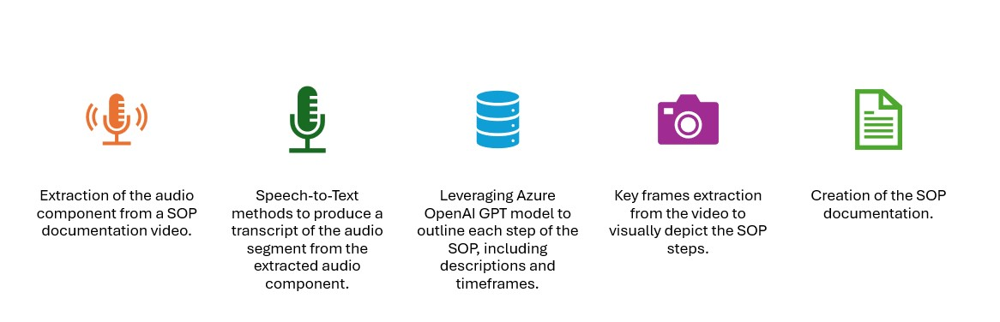
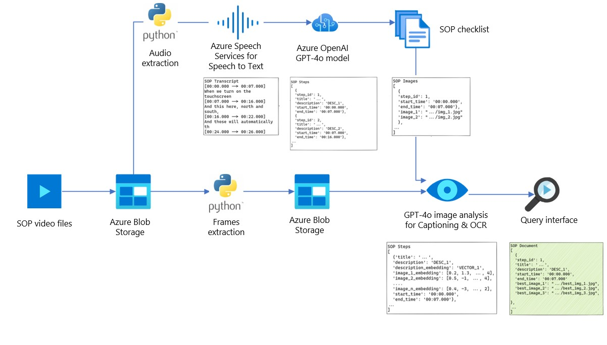

<h2>
VANTAGE Genie Accelerator Processing Steps
</h2>
<div style="display: flex; justify-content: center; align-items: center;">
    
</div>

<h2>
VANTAGE Genie Accelerator Architecture
</h2>
<div style="display: flex; justify-content: center; align-items: center;">
    
</div>

<h2>
Implementation overview
</h2>

The application is implemented using Streamlit framework.

Azure infrastructure required to run this accelerator can be deployed by using azd or Deploy-to-Azure button.

Once infrastructure is deployed, required environment variables are saved to .azure/<env_name>/.env file.  This file is read by load_dotenv and used in the Streamlit application.

Alternatively, if the pre existing resources need to be used, manually configure .env file.

<h2>
Prerequisites
</h2>

- Install [Azure CLI](https://learn.microsoft.com/en-us/cli/azure/install-azure-cli)

- Install [Azure Developer CLI](https://learn.microsoft.com/en-us/azure/developer/azure-developer-cli/install-azd)

- Install [Python UV package manager](https://docs.astral.sh/uv/getting-started/installation/)

- On Windows install the [Platform PowerShell](https://learn.microsoft.com/en-us/powershell/scripting/install/installing-powershell-on-windows?view=powershell-7.4)

    - **Note** You MUST install Platform PowerShell; Windows PowerShell is not sufficient.
    
- Login to your tentnant with Azure CLI `az login`

<h2>
Quick deploy
</h2>

<h3>
Deploy the infrastructure using azd (substitute switzerlandnorth with the region relevant to you)
</h3>

```sh
AZURE_LOCATION=switzerlandnorth azd up
```

**Note** 'Deploying services (azd deploy)' stage can take up to 15 min.

Once infrastructure is provisioned, .azure/<env_name>/.env will be automatically updated with relevant values.

<h3>
Deploy the infrastructure using deployment button (NOT IMPLEMENTED)
</h3>

[](https://portal.azure.com/#create/Microsoft.Template/uri/https%3A%2F%2Fraw.githubusercontent.com%2Fsjuratov%2Fsop-doc-creation%2Fmain%2Finfra%2Fmain.json)

<h2>
ENV Variables
</h2>

The env variables are read from the azd config file located at:

```
.azure/<env_name>/.env
```
If azd has been executed, you can display those with the following command:

```
azd env get-values
```

If azd has not been executed, the application will try to source the standard .env file.

<h3>
Azure AI Speech environment variables
</h3>

AZURE_SPEECH_ACCOUNT_NAME

AZURE_SPEECH_KEY

AZURE_SPEECH_REGION

<h3>
Azure OpenAI environment variables
</h3>

AZURE_OPENAI_ACCOUNT_NAME

AZURE_OPENAI_DEPLOYMENT_NAME

AZURE_OPENAI_ENDPOINT

AZURE_OPENAI_KEY

<h2>
Run application
</h2>

```
cd src/frontend
uv sync
./.venv/bin/streamlit run streamlit_app.py
```