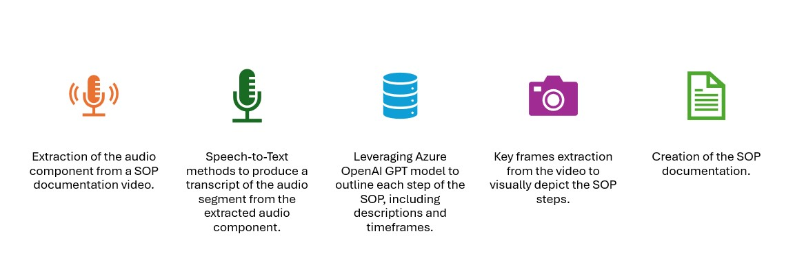

# Azure AI services for SOP document generation from a video file

<div style="display: flex; justify-content: center; align-items: center;">
    
</div>

## What is SOP?

A **SOP**, an acronym for **"standard operating procedure"**, is a document designed to explain in detail every aspect of the way a task is carried out in a company.

It covers the "who" - departments, employees, managers - the "when" - start and end dates of the operation - and the "what" - the various stages.
There are several reasons for setting up an SOP:
- To ensure the reproducibility of a procedure,
- To transfer the company's know-how from one employee to another, from one generation to another,
- Avoid errors and potential hazards,
- Optimizing the production chain,
- Comply with regulations or legislation in force.

## SOP steps

<div style="display: flex; justify-content: center; align-items: center;">
    
</div>

## SOP architecture

<div style="display: flex; justify-content: center; align-items: center;">
    
</div>

Based on the original work by [serge.retkowsky@microsoft.com](https://github.com/retkowsky).

# Implementation overview

The application is implemented as a frontend streamlit app and uses on the infrastructure deployed with azd.

Once infrastructure is available, the key parameters are saved in the azd environments .env file.  This file is read by load_dotenv and used in the frontend app.

Alternatively, if the pre existing resources need to be used, configure .env file.

# Prerequisites

- Install [Azure CLI](https://learn.microsoft.com/en-us/cli/azure/install-azure-cli)
- Install [Azure Developer CLI](https://learn.microsoft.com/en-us/azure/developer/azure-developer-cli/install-azd)
- On Windows install the (Platform PowerShell)[https://learn.microsoft.com/en-us/powershell/scripting/install/installing-powershell-on-windows?view=powershell-7.4]. **OBS!** It is MUST be installed - it is NOT a Windows PowerShell.
- Login to your tentnant with Azure CLI `az login`

# Deploy the infrastructure

```sh
azd env set AZURE_LOCATION 'swedencentral'
azd up
```

**OBS!** 'Deploying services (azd deploy)' stage can take up to 10 min.

## ENV Variables

The env variables are read from the azd config file located at:

```.azure/<env_name>/.env```

If azd has not been executed, the application will try to source the standard .env file.

### Azure Speech services

AZURE_SPEECH_KEY
AZURE_SPEECH_REGION

### Azure OpenAI
AZURE_OPENAI_ENDPOINT
AZURE_OPENAI_KEY

# Run

```
cd src/frontend
streamlit run streamlit_app.py
```
